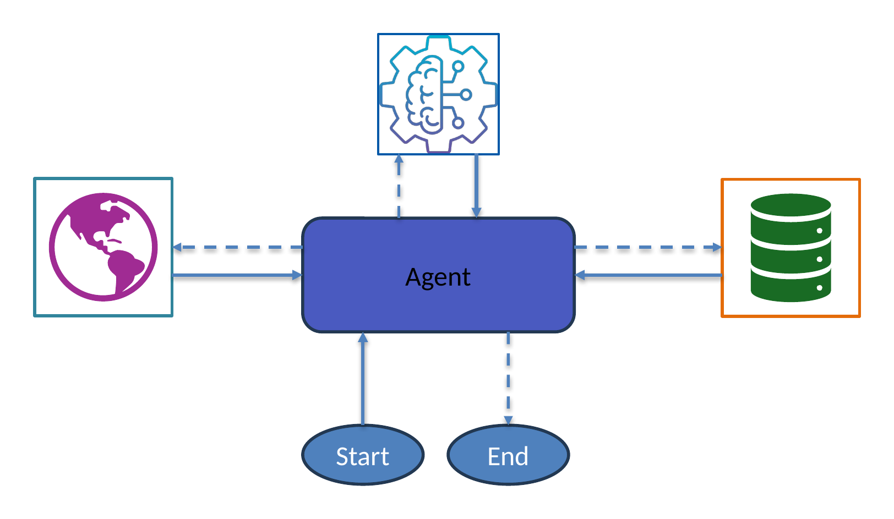

# Module 1: Foundations

Build a minimal Strands agent, run it, and inspect every step of the agentic loop.

## What you'll learn

- The 5 steps of the agentic loop: Input → Reasoning → Tool Selection → Tool Execution → Response
- How to define a tool with `@tool` and why the docstring matters
- How to create an `Agent` with tools and a system prompt
- How to inspect `agent.messages` to see every loop step
- Built-in observability: `result.metrics` and DEBUG logging

## Architecture

## Files

| File | Purpose |
|------|---------|
| `module-01.ipynb` | Step-by-step notebook: define tool → run agent → inspect loop → observability |
| `requirements.txt` | `strands-agents>=1.52.0` |

## Run

Open `module-01.ipynb` in VS Code or JupyterLab and run cells top to bottom.

## Prerequisites

- Python 3.10 or higher
- AWS credentials with Amazon Bedrock access in your workshop region

## Next

→ [Module 2: Single Agent](../02-single-agent/)
