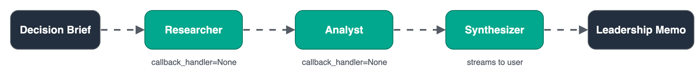

# Module 2: Sequential Chain

**Pattern 1.** Break the single-agent ceiling with a 3-stage pipeline where each agent has one focused job and passes its output to the next.

## Architecture




## What you'll build

A 3-stage pipeline: Researcher → Analyst → Synthesizer. Each agent has a narrow system prompt and a small context window — only what it needs for its role.

## Files

| File | Purpose |
|------|---------|
| `module-02.ipynb` | Step-by-step notebook: prompts → pipeline → inspect → metrics |
| `chat.py` | Run the pipeline interactively from the terminal |
| `requirements.txt` | `strands-agents>=1.52.0` |

## Key concepts

- Sequential pipeline — output of one agent is the input of the next
- `callback_handler=None` — silent intermediate agents; only the final one streams
- Each agent has a **small, focused context** — no single agent holds everything
- `str(result)` — convert `AgentResult` to string for chaining

## Strands Agents SDK

Sequential agent pipelines are implemented with the [Strands Agents SDK](https://strandsagents.com/latest/?trk=87c4c426-cddf-4799-a299-273337552ad8&sc_channel=el).
In Strands, a sequential workflow chains agents in Python — each agent's output becomes the next agent's input.
See the [Workflow documentation](https://strandsagents.com/docs/user-guide/concepts/multi-agent/workflow/index.md?trk=87c4c426-cddf-4799-a299-273337552ad8&sc_channel=el) and [multi-agent patterns](https://strandsagents.com/docs/user-guide/concepts/multi-agent/multi-agent-patterns/index.md?trk=87c4c426-cddf-4799-a299-273337552ad8&sc_channel=el).

```python
from strands import Agent

researcher  = Agent(system_prompt=..., callback_handler=None)
analyst     = Agent(system_prompt=..., callback_handler=None)
synthesizer = Agent(system_prompt=...)

research = researcher(f"Gather data for: {brief}")
analysis = analyst(f"Brief:
{brief}

Research:
{research}")
memo     = synthesizer(f"Brief:
{brief}

Analysis:
{analysis}")
```

**Pricing:**
- [Amazon Bedrock model pricing](https://aws.amazon.com/bedrock/pricing/?trk=87c4c426-cddf-4799-a299-273337552ad8&sc_channel=el) — inference costs per token
- [Amazon Bedrock AgentCore pricing](https://aws.amazon.com/bedrock/agentcore/pricing/?trk=87c4c426-cddf-4799-a299-273337552ad8&sc_channel=el) — Runtime invocation costs

## Run

```bash
pip install -r requirements.txt
python chat.py
```

## Prerequisites

Module 1 — this module imports tools from `../01-strands-foundations/decision_brief_tools.py`.

## Next

→ [Module 3: Parallel Fork-Join](../03-parallel-fork-join/)
