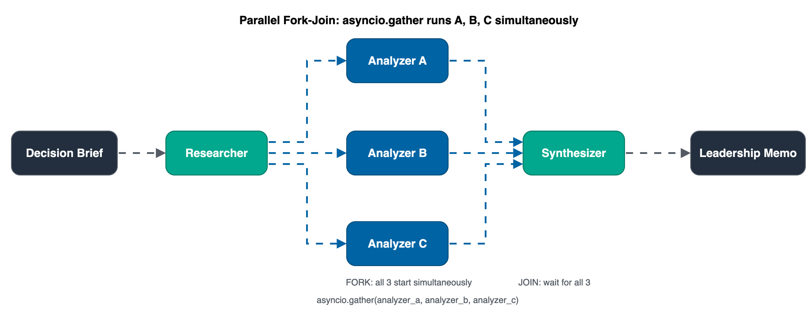

# Module 3: Parallel Fork-Join

**Pattern 2.** Fork independent sub-tasks to run simultaneously, then merge results: latency drops to the slowest single worker.

## Architecture




## What you'll build

A pipeline that forks three Option Analyzers (A, B, C) in parallel using `asyncio.gather` and `invoke_async`, then merges their analyses into a final memo.

## Files

| File | Purpose |
|------|---------|
| `module-03.ipynb` | Step-by-step notebook: setup → research → fork → join → synthesize → metrics |
| `chat.py` | Run the parallel pipeline interactively |
| `requirements.txt` | `strands-agents>=1.52.0`, `nest-asyncio>=1.6.0` |

## Key concepts

- `agent.invoke_async(prompt)`: runs an agent as a coroutine (non-blocking)
- `asyncio.gather(...)`: fork: starts N coroutines simultaneously; join: waits for all
- `nest_asyncio.apply()`: required for `asyncio.gather` inside Jupyter notebooks
- Wall-clock time ≈ slowest single analyzer (not sum of all three)

## Strands Agents SDK

Parallel fork-join uses `Agent.invoke_async()`: the async version of `agent()` that returns a coroutine.
`asyncio.gather()` runs multiple coroutines simultaneously and returns when all complete.
See the [Strands Agents SDK documentation](https://strandsagents.com/latest/?trk=87c4c426-cddf-4799-a299-273337552ad8&sc_channel=el).

```python
from strands import Agent
import asyncio

result_a, result_b, result_c = await asyncio.gather(
    analyzer_a.invoke_async(f"Option A..."),
    analyzer_b.invoke_async(f"Option B..."),
    analyzer_c.invoke_async(f"Option C..."),
)
```

> `Agent.invoke_async()` is documented in the Strands SDK: it is the async equivalent of calling `agent(prompt)` directly.

**Pricing:**
- [Amazon Bedrock model pricing](https://aws.amazon.com/bedrock/pricing/?trk=87c4c426-cddf-4799-a299-273337552ad8&sc_channel=el): all 3 parallel agents call Bedrock concurrently
- [Amazon Bedrock AgentCore pricing](https://aws.amazon.com/bedrock/agentcore/pricing/?trk=87c4c426-cddf-4799-a299-273337552ad8&sc_channel=el): Runtime invocation costs

## Run

```bash
pip install -r requirements.txt
python chat.py
```

## Prerequisites

Module 1: imports tools from `../01-strands-foundations/decision_brief_tools.py`.

## Next

→ [Module 4: Critic-Refiner](../04-critic-refiner/)
