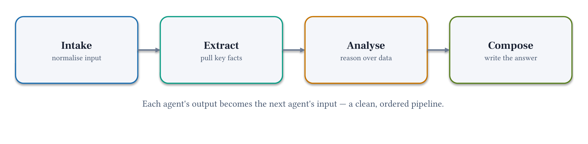

# Module 3: Sequential Chain

**Pattern 1.** Break the single-agent ceiling with a 3-stage pipeline where each agent has one focused job and passes its output to the next.

**Strands primitive:** `GraphBuilder` (Workflow / DAG)

## Architecture



## What you'll build

A 3-stage pipeline — Researcher → Analyst → Synthesizer — defined as a directed graph.
Each node's output is automatically passed as input to the next node by the graph engine.
Each agent has a narrow system prompt and sees only what it needs for its role.

## Files

| File | Purpose |
|------|---------|
| `module-03.ipynb` | Step-by-step notebook: prompts → GraphBuilder → run → inspect |
| `chat.py` | Run the pipeline interactively from the terminal |
| `requirements.txt` | `strands-agents>=1.52.0` |
| `production/` | Deploy specialists to AgentCore Runtime; coordinate via `chain.py` |

## Key concepts

- **GraphBuilder**: Strands primitive for deterministic sequential workflows (Workflow / DAG)
- **`add_node` / `add_edge`**: declare the graph structure; the engine enforces execution order
- **Output propagation**: each node's output is automatically passed as input to connected nodes
- **`callback_handler=None`**: silent intermediate agents; display the final result explicitly
- **Focused context**: no single agent holds everything — each sees only its stage's inputs

## Strands GraphBuilder

```python
from strands import Agent
from strands.multiagent import GraphBuilder

researcher  = Agent(system_prompt=RESEARCHER_PROMPT,  callback_handler=None)
analyst     = Agent(system_prompt=ANALYST_PROMPT,     callback_handler=None)
synthesizer = Agent(system_prompt=SYNTHESIZER_PROMPT, callback_handler=None)

builder = GraphBuilder()
builder.add_node(researcher,  "researcher")
builder.add_node(analyst,     "analyst")
builder.add_node(synthesizer, "synthesizer")
builder.add_edge("researcher", "analyst")
builder.add_edge("analyst",    "synthesizer")

result = builder.build()(brief)

# Extract the final node's output
for node in reversed(result.execution_order):
    if node.node_id == "synthesizer":
        print(str(node.result))
        break
```

See the [Strands GraphBuilder docs](https://strandsagents.com/docs/user-guide/concepts/multi-agent/graph/) and [multi-agent patterns](https://strandsagents.com/docs/user-guide/concepts/multi-agent/multi-agent-patterns/).

**Pricing:**
- [Amazon Bedrock model pricing](https://aws.amazon.com/bedrock/pricing/)
- [Amazon Bedrock AgentCore pricing](https://aws.amazon.com/bedrock/agentcore/pricing/)

## Prerequisites

- Python 3.10 or higher
- Module 2: this module imports tools from `../02-single-agent/decision_brief_tools.py`

## Run

```bash
uv pip install -r requirements.txt
uv run python chat.py
```

## Next

→ [Module 4: Parallel Fork-Join](../04-parallel-fork-join/)
