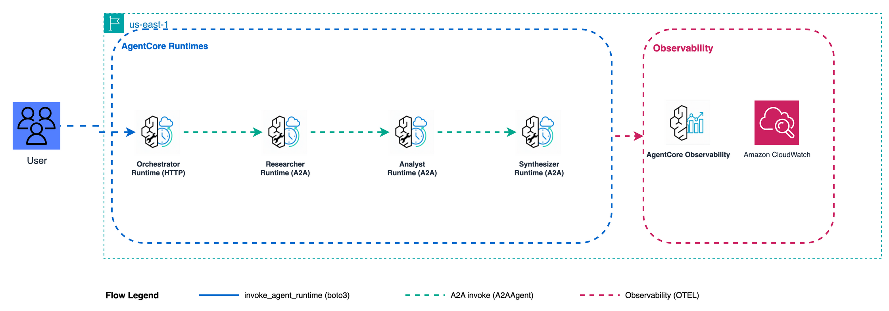

# Pattern 1: Sequential Chain - Production Deployment

Deploy Pattern 1 (Sequential Chain) to Amazon Bedrock AgentCore Runtime using the A2A protocol.



**Pattern:** Researcher → Analyst → Synthesizer in fixed sequential order.  
**Strands primitive:** `GraphBuilder` (Workflow / DAG)

---

## Architecture

**Specialists** run as AgentCore Runtimes on port 9000 using the A2A protocol.  
**Coordination** is handled by `chain.py` — a local Python script using `GraphBuilder` with `A2AAgent` nodes.

No orchestrator runtime is deployed. Pattern 1 is a deterministic pipeline with fixed execution order;
it requires no LLM routing decisions, so a lightweight coordinator script is enough.

> **Production alternatives for the coordination layer:**  
> - AWS Lambda — stateless, event-driven, no servers  
> - AWS Step Functions — durable retries, execution history, visual workflow  
> The specialist runtimes stay unchanged in all cases.

---

## Files

| File | Purpose |
|------|---------|
| `deploy.py` | Deploy 3 specialist runtimes (A2A) in parallel |
| `cleanup.py` | Delete all runtimes, IAM roles, S3 objects |
| `chain.py` | Sequential chain coordinator — runs locally via GraphBuilder |
| `chat.py` | Interactive multi-turn chat (submit multiple briefs) |
| `a2a_utils.py` | SigV4 auth and A2A utilities for chain.py |
| `invoke.py` | Single invocation helper — wraps chain.py |
| `specialists/researcher/main.py` | Researcher A2A runtime |
| `specialists/analyst/main.py` | Analyst A2A runtime |
| `specialists/synthesizer/main.py` | Synthesizer A2A runtime |

---

## Deploy

```bash
cd samples/03-*/production

python deploy.py                     # default prefix m3
python deploy.py --name-prefix m3ws  # custom prefix (max 8 chars)
python deploy.py --dry-run
```

Deploys **3 runtimes**: researcher (A2A), analyst (A2A), synthesizer (A2A).  
Saves ARNs to `.env_arns`.

---

## Run

```bash
source .env_arns

# Single run (default brief)
python chain.py

# Interactive multi-turn chat (submit multiple briefs)
python chat.py
```

---

## Sample brief

```
NovaCart Premium Tier: Options A ($19.99/mo invite-only), B ($14.99/mo 5% pilot),
C ($12.99/mo full launch). Target: +15% CLV in 6 months. Budget: $2M.
```

First call: 1-2 min (cold start).  
Subsequent calls: 15-30s (warm containers).

---

## Cleanup

```bash
python cleanup.py --name-prefix m3          # delete everything
python cleanup.py --name-prefix m3 --dry-run
```

---

## Observability

AgentCore sends all telemetry to **Amazon CloudWatch**:

- **Logs:** `/aws/bedrock-agentcore/runtimes/<id>-DEFAULT` (one per runtime)
- **Traces:** CloudWatch Transaction Search (X-Ray settings > GenAI Observability)

---

## References

- [AgentCore Runtime docs](https://docs.aws.amazon.com/bedrock-agentcore/latest/devguide/runtime.html)
- [AgentCore A2A protocol](https://docs.aws.amazon.com/bedrock-agentcore/latest/devguide/runtime-a2a.html)
- [Strands GraphBuilder](https://strandsagents.com/docs/user-guide/concepts/multi-agent/graph/)
- [Strands A2AAgent](https://strandsagents.com/docs/user-guide/concepts/multi-agent/agent-to-agent/)
- [bedrock-agentcore Python SDK](https://pypi.org/project/bedrock-agentcore/)
