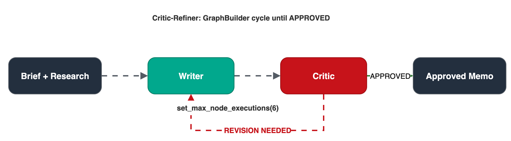

# Module 4: Critic-Refiner

**Pattern 3.** Add a quality gate: the Writer drafts the memo, the Critic evaluates it against a checklist, and if the bar is not met the memo cycles back for revision until approved.

## Architecture




## What you'll build

A `GraphBuilder` feedback loop: Writer → Critic → [APPROVED: done | REVISION NEEDED: cycle back to Writer].

## Files

| File | Purpose |
|------|---------|
| `module-04.ipynb` | Step-by-step notebook: research → Writer → Critic → graph loop → metrics |
| `chat.py` | Run the critic-refiner pipeline interactively |
| `requirements.txt` | `strands-agents>=1.52.0` |

## Key concepts

- `GraphBuilder`: builds a directed graph of agents with conditional edges
- Cycle edge: `add_edge("critic", "writer", condition=needs_revision)` creates the feedback loop
- `set_entry_point("writer")`: required when a cycle makes the start node ambiguous
- `set_max_node_executions(N)`: safety limit to prevent infinite loops
- `reset_on_revisit(True)`: resets node state on each revisit

## Strands Agents SDK

The Critic-Refiner pattern uses [`GraphBuilder`](https://strandsagents.com/docs/user-guide/concepts/multi-agent/graph/index.md?trk=87c4c426-cddf-4799-a299-273337552ad8&sc_channel=el) from `strands.multiagent`: a deterministic directed graph with optional cycle edges.
Condition functions on edges control routing: `add_edge("critic", "writer", condition=needs_revision)` creates the feedback loop.
See the [Graph documentation](https://strandsagents.com/docs/user-guide/concepts/multi-agent/graph/index.md?trk=87c4c426-cddf-4799-a299-273337552ad8&sc_channel=el) and [multi-agent patterns](https://strandsagents.com/docs/user-guide/concepts/multi-agent/multi-agent-patterns/index.md?trk=87c4c426-cddf-4799-a299-273337552ad8&sc_channel=el).

```python
from strands.multiagent import GraphBuilder

builder = GraphBuilder()
builder.add_node(writer, "writer")
builder.add_node(critic, "critic")
builder.set_entry_point("writer")          # required when a cycle creates ambiguity
builder.add_edge("writer", "critic")
builder.add_edge("critic", "writer", condition=needs_revision)
builder.set_max_node_executions(6)          # prevents infinite loops
builder.set_execution_timeout(120)
builder.reset_on_revisit(True)
graph = builder.build()
result = graph(prompt)
```

**Pricing:**
- [Amazon Bedrock model pricing](https://aws.amazon.com/bedrock/pricing/?trk=87c4c426-cddf-4799-a299-273337552ad8&sc_channel=el)
- [Amazon Bedrock AgentCore pricing](https://aws.amazon.com/bedrock/agentcore/pricing/?trk=87c4c426-cddf-4799-a299-273337552ad8&sc_channel=el)

## Critic output format: critical design rule

The condition function `needs_revision` parses the Critic's text. The Critic **must** respond with either `APPROVED` or `REVISION NEEDED: ...`: if it writes prose instead, conditions fail silently and the graph either loops forever or exits prematurely. The system prompt must enforce this format.

## Run

```bash
pip install -r requirements.txt
python chat.py
```

## Prerequisites

Module 1: imports tools from `../01-strands-foundations/decision_brief_tools.py`.

## Next

→ [Module 5: Dynamic Swarm](../05-dynamic-swarm/)
