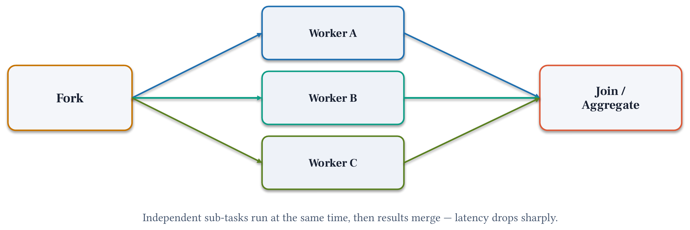

# Module 4: Parallel Fork-Join

**Pattern 2.** Fork independent sub-tasks to run simultaneously, then merge results: latency drops to the slowest single worker instead of the sum of all workers.

## Architecture




## What you'll build

A pipeline that forks three Option Analyzers (A, B, C) in parallel using `GraphBuilder` parallel topology, then merges their analyses into a final memo. `GraphBuilder` detects parallelism from edge structure automatically. No threading or async code required.

## Files

| File | Purpose |
|------|---------|
| `module-04.ipynb` | Step-by-step notebook: setup → research → fork → join → synthesize → metrics |
| `chat.py` | Run the parallel pipeline interactively |
| `requirements.txt` | `strands-agents>=1.52.0`, `nest-asyncio>=1.6.0` |

## Key concepts

- `GraphBuilder`: declares the graph topology; nodes with the same predecessor and no mutual dependency run in parallel automatically
- Fork: three `add_edge("researcher", "analyzer_x")` calls. SDK dispatches all three simultaneously.
- Join: three `add_edge("analyzer_x", "synthesizer")` calls. Synthesizer starts after all three finish.
- `set_execution_timeout(N)`: bounds the total wall-clock time for the graph
- Wall-clock time ≈ slowest single analyzer (not sum of all three)

## Strands Agents SDK

Parallel fork-join uses [`GraphBuilder`](https://strandsagents.com/docs/user-guide/concepts/multi-agent/graph/index.md?trk=87c4c426-cddf-4799-a299-273337552ad8&sc_channel=el) from `strands.multiagent`.
Nodes that share the same predecessor and have no dependency on each other are detected automatically and dispatched concurrently.
See the [Graph documentation](https://strandsagents.com/docs/user-guide/concepts/multi-agent/graph/index.md?trk=87c4c426-cddf-4799-a299-273337552ad8&sc_channel=el) and [multi-agent patterns](https://strandsagents.com/docs/user-guide/concepts/multi-agent/multi-agent-patterns/index.md?trk=87c4c426-cddf-4799-a299-273337552ad8&sc_channel=el).

```python
from strands.multiagent import GraphBuilder

builder = GraphBuilder()
builder.add_node(researcher,  "researcher")
builder.add_node(analyzer_a,  "analyzer_a")
builder.add_node(analyzer_b,  "analyzer_b")
builder.add_node(analyzer_c,  "analyzer_c")
builder.add_node(synthesizer, "synthesizer")

# Fork: all three analyzers start once researcher finishes
builder.add_edge("researcher", "analyzer_a")
builder.add_edge("researcher", "analyzer_b")
builder.add_edge("researcher", "analyzer_c")

# Join: synthesizer waits for all three
builder.add_edge("analyzer_a", "synthesizer")
builder.add_edge("analyzer_b", "synthesizer")
builder.add_edge("analyzer_c", "synthesizer")

builder.set_execution_timeout(300)
graph = builder.build()
result = graph(DECISION_BRIEF)
```

**Pricing:**
- [Amazon Bedrock model pricing](https://aws.amazon.com/bedrock/pricing/?trk=87c4c426-cddf-4799-a299-273337552ad8&sc_channel=el): all 3 parallel agents call Bedrock concurrently
- [Amazon Bedrock AgentCore pricing](https://aws.amazon.com/bedrock/agentcore/pricing/?trk=87c4c426-cddf-4799-a299-273337552ad8&sc_channel=el): Runtime invocation costs

## Run

```bash
uv pip install -r requirements.txt
uv run python chat.py
```

## Prerequisites

- Python 3.10 or higher
- Module 2: imports tools from `../02-single-agent/decision_brief_tools.py`

## Next

→ [Module 5: Critic-Refiner](../05-critic-refiner/)
