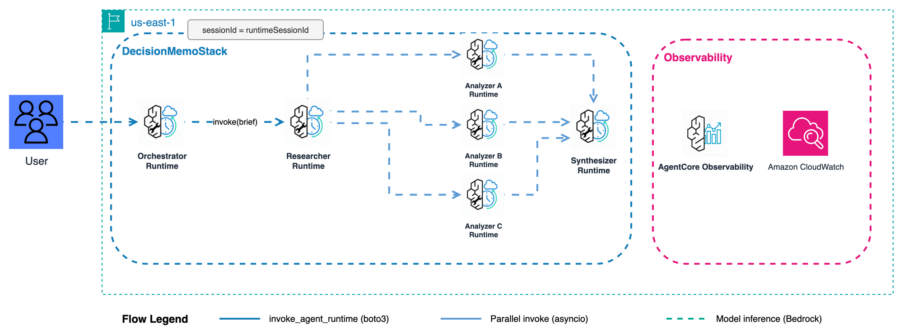

# Pattern 2: Parallel Fork-Join - Production Deployment

Deploy the Pattern 2: Parallel Fork-Join to Amazon Bedrock AgentCore Runtime using the A2A protocol.



**Pattern:** Researcher gathers data, then 3 Analyzers run simultaneously (Options A, B, C), results merge to Synthesizer.

**Strands primitive:** `GraphBuilder (DAG)`

---

## Contents

- [Architecture](#architecture)
- [Files](#files)
- [Deploy](#deploy)
- [Invoke](#invoke)
- [Multi-turn chat](#multi-turn-chat)
- [Sample brief](#sample-brief)
- [Cleanup](#cleanup)
- [Observability](#observability)
- [References](#references)

---

## Architecture

```
User
 |
 v  sessionId = runtimeSessionId (routes to same container)
 |  actorId   = X-Amzn-Bedrock-AgentCore-Runtime-Custom-Actor-Id header
Orchestrator Runtime  (HTTP, port 8080, BedrockAgentCoreApp)
 |  GraphBuilder DAG: `researcher → [analyzer_a || analyzer_b || analyzer_c] → synthesizer`
  ├──A2A──► Researcher Runtime
  ├──A2A──► Analyzer Runtime (×3 concurrent)
  └──A2A──► Synthesizer Runtime
```

**Specialists** run on port 9000 using the A2A protocol (`serve_a2a`).
**Orchestrator** receives calls from `chat.py` via `invoke_agent_runtime` (HTTP),
then calls specialists via `A2AAgent` with SigV4 auth in isolated threads.

Per-session isolation: orchestrators keyed by `session_id` so different users
never share conversation history.

---

## Files

| File | Purpose |
|------|---------|
| `deploy.py` | Deploy 4 runtimes (specialists A2A + orchestrator HTTP) |
| `cleanup.py` | Delete all runtimes, IAM roles, S3 objects |
| `chat.py` | Interactive multi-turn chat (passes actorId + sessionId) |
| `invoke.py` | Single invocation. Pass orchestrator ARN as argument. |
| `orchestrator/main.py` | Orchestrator Runtime code |
| `specialists/researcher/main.py`, `analyzer/`, `synthesizer/` | A2A specialist runtimes |

---

## Deploy

```bash
cd samples/04-*/production

python deploy.py                     # default prefix m4
python deploy.py --name-prefix m4ws  # custom prefix (max 8 chars)
python deploy.py --dry-run
```

Deploys `4` runtimes: researcher (A2A), analyzer (A2A, called 3× in parallel), synthesizer (A2A).

---

## Invoke

```bash
python invoke.py arn:aws:bedrock-agentcore:us-east-1:ACCOUNT:runtime/m4_orchestrator-XXXXX
```

---

## Multi-turn chat

```bash
python chat.py \
  --actor-id user-123 \
  --runtime-arn arn:aws:bedrock-agentcore:us-east-1:ACCOUNT:runtime/m4_orchestrator-XXXXX
```

---

## Sample brief

```
NovaCart Premium Tier: Options A ($19.99/mo invite-only), B ($14.99/mo 5% pilot),
C ($12.99/mo full launch). Target: +15% CLV in 6 months. Budget: $2M.
```

First call: 5-10 min (cold start across 4 specialist runtimes).
Subsequent calls in the same session: 2-4 min (warm containers).

---

## Cleanup

```bash
python cleanup.py --name-prefix m4          # delete everything
python cleanup.py --name-prefix m4 --dry-run
```

---

## Observability

AgentCore sends all telemetry to **Amazon CloudWatch**:

- **Logs:** `/aws/bedrock-agentcore/runtimes/<id>-DEFAULT` (one per runtime)
- **Traces:** CloudWatch Transaction Search (X-Ray settings > GenAI Observability)

---

## References

- [AgentCore Runtime docs](https://docs.aws.amazon.com/bedrock-agentcore/latest/devguide/runtime.html)
- [AgentCore A2A protocol](https://docs.aws.amazon.com/bedrock-agentcore/latest/devguide/runtime-a2a.html)
- [Strands GraphBuilder](https://strandsagents.com/docs/user-guide/concepts/multi-agent/graph/)
- [Strands A2A Agent-as-Tool](https://strandsagents.com/docs/user-guide/concepts/multi-agent/agent-to-agent/#as-a-tool)
- [bedrock-agentcore Python SDK](https://pypi.org/project/bedrock-agentcore/)
