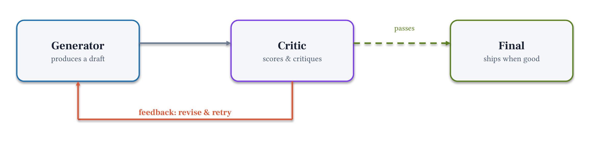
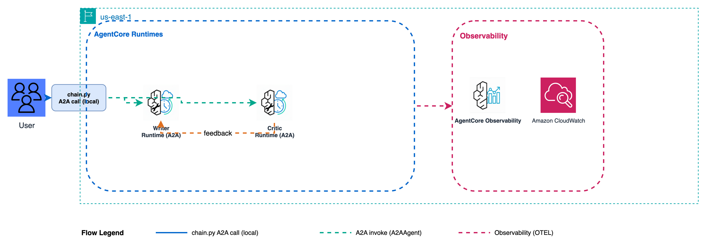

# Module 5: Critic-Refiner (Reflection)

**Pattern 3.** Add a quality gate: the Writer drafts a memo, the Critic evaluates it, and if the bar is not met the memo cycles back for revision — until `APPROVED`.

**Strands primitive:** `GraphBuilder` + cycle edge with `condition=`

## Architecture

### Local (notebook / chat.py)



### Production (AgentCore Runtimes)



## What you'll build

A `GraphBuilder` feedback loop with two agents:

- **Writer** — produces or revises the leadership memo
- **Critic** — evaluates it against 5 criteria; outputs `APPROVED` or `REVISION NEEDED: ...`

The cycle edge `add_edge("critic", "writer", condition=needs_revision)` routes failed evaluations back to the Writer automatically.

## Files

| File | Purpose |
|------|---------|
| `module-05.ipynb` | Step-by-step notebook: Writer + Critic agents → GraphBuilder cycle → run → inspect |
| `chat.py` | Run the critic-refiner interactively from the terminal |
| `requirements.txt` | `strands-agents>=1.52.0` |
| `production/` | Deploy Writer + Critic as separate A2A runtimes |

## Key concepts

- `GraphBuilder` + cycle edge: `add_edge("critic", "writer", condition=needs_revision)`
- `set_entry_point("writer")`: required when a cycle creates start-node ambiguity
- `set_max_node_executions(N)`: safety limit to prevent infinite loops
- `reset_on_revisit(True)`: clears node state on each revisit (fresh context per revision)
- Critic output format: must start with `APPROVED` or `REVISION NEEDED:` — condition functions parse this signal

## Strands GraphBuilder

```python
from strands import Agent
from strands.multiagent import GraphBuilder

writer = Agent(system_prompt=WRITER_PROMPT, callback_handler=None)
critic = Agent(system_prompt=CRITIC_PROMPT, callback_handler=None)

def needs_revision(state):
    r = state.results.get("critic")
    return bool(r) and "revision needed" in str(r.result).lower()

builder = GraphBuilder()
builder.add_node(writer, "writer")
builder.add_node(critic, "critic")
builder.set_entry_point("writer")                              # required: cycle creates ambiguity
builder.add_edge("writer", "critic")
builder.add_edge("critic", "writer", condition=needs_revision) # cycle: revision → writer
builder.set_max_node_executions(8)
builder.set_execution_timeout(180)
builder.reset_on_revisit(True)

result = builder.build()(brief)

# Extract last approved draft
for node in reversed(result.execution_order):
    if node.node_id == "writer":
        print(str(node.result))
        break
```

See the [Strands GraphBuilder docs](https://strandsagents.com/docs/user-guide/concepts/multi-agent/graph/) and [multi-agent patterns](https://strandsagents.com/docs/user-guide/concepts/multi-agent/multi-agent-patterns/).

**Pricing:**
- [Amazon Bedrock model pricing](https://aws.amazon.com/bedrock/pricing/)
- [Amazon Bedrock AgentCore pricing](https://aws.amazon.com/bedrock/agentcore/pricing/)

## Critical design rule: Critic output format

The condition function parses the Critic's text. The Critic **must** respond with exactly `APPROVED` or `REVISION NEEDED: [criteria]`. If it writes prose, conditions fail silently. The system prompt must enforce this.

## Prerequisites

- Python 3.10 or higher
- Module 2: `decision_brief_tools.py` is available at `../02-single-agent/` for production's researcher specialist

## Run

```bash
uv pip install -r requirements.txt
uv run python chat.py
```

## Production

Two separate A2A runtimes — `chain.py` manages the loop by passing context explicitly.


See [`production/README.md`](./production/README.md) for deploy instructions.

## Next

→ [Module 6: Dynamic Swarm](../06-dynamic-swarm/)

