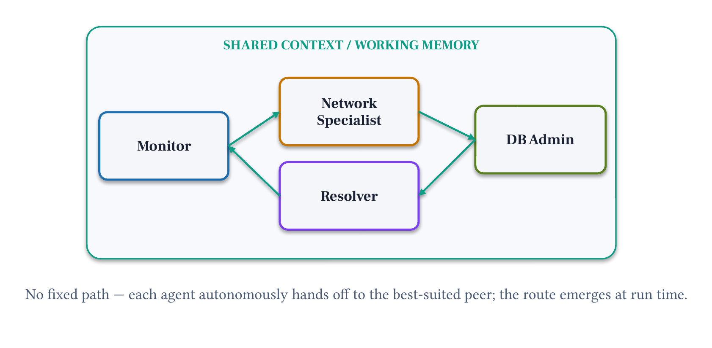

# Module 6: Dynamic Swarm

**Pattern 4.** Agents hand off autonomously: no fixed path, no orchestrator. The route through the team emerges at runtime based on what each agent decides to do next.

## Architecture




```
Task (brief)
     │
     ▼
┌──────────────┐   SHARED CONTEXT / WORKING MEMORY
│  Researcher  │  ← entry point; uses tools, gathers data
└──────┬───────┘
       │  handoff_to_agent("analyst")   ← autonomous decision
       ▼
┌──────────────┐
│   Analyst    │  ← receives shared context + handoff message
└──────┬───────┘
       │  handoff_to_agent("writer")    ← autonomous decision
       ▼
┌──────────────┐
│    Writer    │  ← writes final memo; decides NOT to hand off
└──────────────┘
```

This path is not programmed: it emerges based on agent descriptions and what each agent decides.

## What you'll build

A 3-agent Swarm (Researcher → Analyst → Writer) where routing is autonomous. No edges are defined: each agent reads the descriptions of its peers and decides who to hand off to.

## Files

| File | Purpose |
|------|---------|
| `module-06.ipynb` | Step-by-step notebook: create agents → build swarm → run → inspect path → metrics |
| `chat.py` | Run the swarm interactively from the terminal |
| `requirements.txt` | `strands-agents>=1.52.0` |

## Key concepts

- `Swarm([agents], entry_point=agent)`: no routing code, agents decide
- `description` field: the routing signal; write it for the model, not for humans
- `handoff_to_agent`: automatically added to each agent by the SDK
- `result.node_history`: the path that emerged at runtime
- `result.results["agent_name"]`: output from a specific agent
- `result.accumulated_usage`: total token usage across all agents

## Strands Agents SDK

The Dynamic Swarm uses [`Swarm`](https://strandsagents.com/docs/user-guide/concepts/multi-agent/swarm/index.md?trk=87c4c426-cddf-4799-a299-273337552ad8&sc_channel=el) from `strands.multiagent`.
The Swarm automatically equips each agent with a `handoff_to_agent` tool: agents use this to transfer control autonomously.
The `description` field on each agent is what peers read to decide who to hand off to.
See the [Swarm documentation](https://strandsagents.com/docs/user-guide/concepts/multi-agent/swarm/index.md?trk=87c4c426-cddf-4799-a299-273337552ad8&sc_channel=el) and [multi-agent patterns](https://strandsagents.com/docs/user-guide/concepts/multi-agent/multi-agent-patterns/index.md?trk=87c4c426-cddf-4799-a299-273337552ad8&sc_channel=el).

```python
from strands import Agent
from strands.multiagent import Swarm

researcher = Agent(name="researcher",
    description="Market research specialist with tools...",   # routing signal
    system_prompt="...",
    tools=[...])
analyst = Agent(name="analyst", description="...", system_prompt="...")
writer  = Agent(name="writer",  description="...", system_prompt="...")

swarm = Swarm([researcher, analyst, writer],
    entry_point=researcher,
    max_handoffs=6,
    max_iterations=10,
    execution_timeout=180.0)
result = swarm(task)
# result.status, result.node_history, result.results["agent_name"]
```

**Pricing:**
- [Amazon Bedrock model pricing](https://aws.amazon.com/bedrock/pricing/?trk=87c4c426-cddf-4799-a299-273337552ad8&sc_channel=el)
- [Amazon Bedrock AgentCore pricing](https://aws.amazon.com/bedrock/agentcore/pricing/?trk=87c4c426-cddf-4799-a299-273337552ad8&sc_channel=el)

## Swarm vs Sequential Chain

| | Sequential Chain (M2) | Dynamic Swarm (M5) |
|---|---|---|
| Path | Fixed in Python code | Emergent: agents decide |
| Control | Deterministic | Autonomous |
| Change path | Rewrite code | Change `description` |
| Best for | Known, stable workflows | Exploration, multi-domain tasks |

## Prerequisites

- Python 3.10 or higher
- Module 2 (Single Agent) must be in the same `samples/` folder. The notebooks and chat.py load `decision_brief_tools.py` from `../02-single-agent/` at runtime — it contains the NovaCart mock data and business intelligence tools used across all modules. Production deployments are self-contained (they bundle their own `mock_tools.py`).

## Run

```bash
uv pip install -r requirements.txt
uv run python chat.py
```

## Next

→ [Module 7: Agent-as-Tool](../07-agent-as-tool/)
