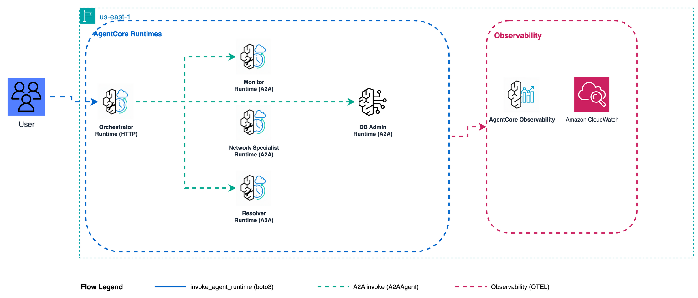

# Pattern 4: Dynamic Swarm - Production Deployment

Deploy the Dynamic Swarm pattern to Amazon Bedrock AgentCore Runtime.



**Pattern:** Researcher -> Analyst -> Writer with autonomous handoffs (Strands Swarm). Agents decide when to hand off to the next agent. All agents run inside one Runtime container.

---

## Contents

- [Files](#files)
- [Deploy](#deploy)
- [Invoke](#invoke)
- [Multi-turn chat](#multi-turn-chat)
- [Cleanup](#cleanup)
- [Observability](#observability)

---

## Files

| File | Purpose |
|------|---------|
| `main.py` | AgentCore entry point - `@app.entrypoint` wrapping the Swarm with autonomous handoffs |
| `mock_tools.py` | Self-contained business intelligence tools (no external dependencies) |
| `requirements.txt` | Runtime dependencies: strands-agents, bedrock-agentcore, OTEL |
| `deploy.py` | **boto3 deploy script** - creates IAM role, uploads code, provisions Runtime |
| `cleanup.py` | **boto3 cleanup script** - deletes Runtime, role, and S3 objects |
| `invoke.py` | Single-invocation script - pass Runtime ARN as argument |

---

## Deploy

```bash
cd samples/06-dynamic-swarm/production

python deploy.py                    # default prefix m6
python deploy.py --name-prefix m6ws # custom prefix (max 20 chars)
python deploy.py --dry-run          # preview without creating
```

The script packages all code with Linux ARM64 dependencies, creates an IAM role, and provisions the Runtime. First deploy takes 2-3 minutes.

---

## Invoke

```bash
python invoke.py arn:aws:bedrock-agentcore:us-east-1:ACCOUNT:runtime/m6_swarm-XXXXX
```

Or with boto3:

```python
import json, uuid, boto3
from botocore.config import Config

client = boto3.client(
    "bedrock-agentcore",
    region_name="us-east-1",
    config=Config(read_timeout=300),
)
response = client.invoke_agent_runtime(
    agentRuntimeArn="arn:aws:bedrock-agentcore:us-east-1:ACCOUNT:runtime/m6_swarm-XXXXX",
    runtimeSessionId=str(uuid.uuid4()),  # 33-256 chars
    payload=json.dumps({
        "prompt": "NovaCart Premium Tier: Options A ($19.99), B ($14.99), C ($12.99). Target +15% CLV."
    }).encode(),
    qualifier="DEFAULT",
)
raw = response["response"].read()
result = json.loads(raw)
print(result.get("response", result) if isinstance(result, dict) else result)
```

---

## Multi-turn chat

Reuse the same `runtimeSessionId` across calls to route requests to the same container. The agent uses `SlidingWindowConversationManager(window_size=20)` to keep conversation history in the container.

---

## Cleanup

```bash
python cleanup.py --name-prefix m6          # delete Runtime + IAM role + S3
python cleanup.py --name-prefix m6 --dry-run
```

---

## Observability

AgentCore sends all telemetry to **Amazon CloudWatch**:

- **Logs:** `/aws/bedrock-agentcore/runtimes/<runtime-id>-DEFAULT`
- **Traces:** CloudWatch Transaction Search (under X-Ray settings > GenAI Observability)

The Swarm handoff sequence appears as child spans under the root invocation span, showing which agent ran and for how long.

---

## References

- [AgentCore Runtime docs](https://docs.aws.amazon.com/bedrock-agentcore/latest/devguide/runtime.html)
- [Strands Agents Swarm](https://strandsagents.com)
- [bedrock-agentcore Python SDK](https://pypi.org/project/bedrock-agentcore/)
