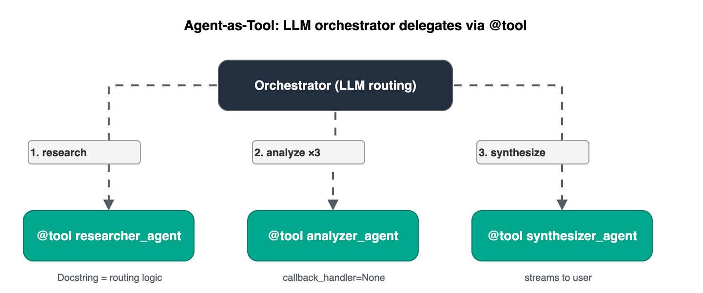

# Module 7: Agent-as-Tool

**Pattern 5.** Wrap specialized agents as callable tools so an LLM orchestrator can delegate like a manager to experts: routing decided by the model, not by Python code.

## Architecture




## What you'll build

An LLM orchestrator that uses three specialist agents as tools. The model decides: call researcher first → call analyzer for each option → call synthesizer. No Python routing code.

## Files

| File | Purpose |
|------|---------|
| `module-06.ipynb` | Step-by-step: prompts → wrap tools → orchestrator → inspect calls → metrics |
| `chat.py` | Run the orchestrator interactively |
| `requirements.txt` | `strands-agents>=1.52.0` |

## Key concepts

- `@tool` wrapping `Agent`: full control over parameters; docstring is the routing logic
- `callback_handler=None`: silent sub-agents; only orchestrator + final synthesizer stream
- LLM routing: the orchestrator decides tool call order and arguments
- Multi-parameter `@tool`: lets the orchestrator pass precise context per call

## Three ways to use Agents as Tools

```python
# Option A: @tool decorator (most control, multi-parameter): used in this module
@tool
def researcher_agent(topic: str) -> str:
    """Research market context..."""
    worker = Agent(tools=[...], system_prompt=..., callback_handler=None)
    return str(worker(topic))

# Option B: pass Agent directly in tools[] (simplest, single string input)
researcher = Agent(system_prompt=..., tools=[...])
orchestrator = Agent(tools=[researcher, analyst, writer])

# Option C: .as_tool() (custom name/description, optional preserve_context)
orchestrator = Agent(tools=[researcher.as_tool(name="...", description="...")])
```

## Strands Agents SDK

The Agents-as-Tools pattern is documented at [https://strandsagents.com/docs/user-guide/concepts/multi-agent/agents-as-tools/index.md?trk=87c4c426-cddf-4799-a299-273337552ad8&sc_channel=el](https://strandsagents.com/docs/user-guide/concepts/multi-agent/agents-as-tools/index.md?trk=87c4c426-cddf-4799-a299-273337552ad8&sc_channel=el).
The Strands Agents SDK supports three ways to use agents as tools:
passing agents directly in `tools[]`, using `.as_tool()`, or wrapping with the `@tool` decorator.

```python
# Option 1: pass Agent directly (SDK auto-converts; single string input)
orchestrator = Agent(tools=[researcher, analyst, writer])

# Option 2: .as_tool() for custom name/description
orchestrator = Agent(tools=[researcher.as_tool(name="...", description="...")])

# Option 3: @tool decorator (full parameter control: used in this module)
@tool
def researcher_agent(topic: str) -> str:
    \"\"\"Research market context...\"\"\"\"
    worker = Agent(tools=[...], system_prompt=..., callback_handler=None)
    return str(worker(topic))
```

See [Agents-as-Tools documentation](https://strandsagents.com/docs/user-guide/concepts/multi-agent/agents-as-tools/index.md?trk=87c4c426-cddf-4799-a299-273337552ad8&sc_channel=el).

**Pricing:**
- [Amazon Bedrock model pricing](https://aws.amazon.com/bedrock/pricing/?trk=87c4c426-cddf-4799-a299-273337552ad8&sc_channel=el)
- [Amazon Bedrock AgentCore pricing](https://aws.amazon.com/bedrock/agentcore/pricing/?trk=87c4c426-cddf-4799-a299-273337552ad8&sc_channel=el)

## Prerequisites

- Python 3.10 or higher

## Run

```bash
uv pip install -r requirements.txt
uv run python chat.py
```

## Prerequisites

Module 2: imports tools from `../02-single-agent/decision_brief_tools.py`.

## Next

→ [Module 8: Capstone: Decision-Memo System](../08-capstone/)
