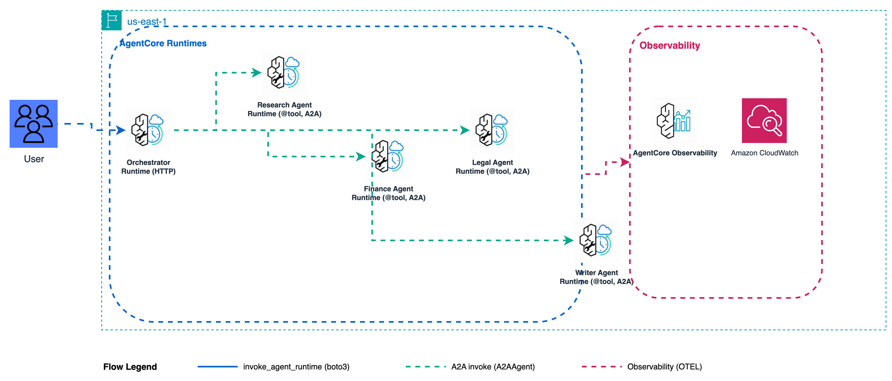

# Pattern 5: Agent-as-Tool - Production Deployment



Deploy Pattern 5 to Amazon Bedrock AgentCore: 5 Runtimes where the LLM orchestrator treats each specialist as a `@tool` function.

**Pattern:** LLM orchestrator (HTTP) delegates to four A2A specialists by calling them as tools. The LLM decides routing order; Python code does not hardcode the sequence.

**Strands primitive:** `A2AAgent` wrapped as `@tool` inside `Agent(tools=[...])`

---

## Architecture

**Specialists** run on port 9000 using the [A2A protocol](https://docs.aws.amazon.com/bedrock-agentcore/latest/devguide/runtime-a2a.html) (`serve_a2a`).
**Orchestrator** receives calls via `invoke_agent_runtime` (HTTP), then calls specialists via `A2AAgent` with SigV4 auth in isolated threads.

Per-session isolation: orchestrator agents keyed by `session_id` so different users never share conversation history.

---

## Files

| File | Purpose |
|------|---------|
| `deploy.py` | Deploy 5 runtimes (4 A2A specialists + 1 HTTP orchestrator) |
| `cleanup.py` | Delete all runtimes, IAM roles, S3 objects |
| `chat.py` | Interactive multi-turn chat in the terminal |
| `invoke.py` | Single invocation |
| `orchestrator/main.py` | Orchestrator: `Agent(tools=[a2a_agents])` with retry on cold start |
| `orchestrator/a2a_utils.py` | SigV4 auth, A2A endpoint construction, retry transport |
| `specialists/research/main.py` | Research A2A specialist |
| `specialists/finance/main.py` | Finance A2A specialist |
| `specialists/legal/main.py` | Legal A2A specialist |
| `specialists/writer/main.py` | Writer A2A specialist |

---

## Deploy

Run from the `production/` folder.

```bash
cd samples/07-agent-as-tool/production

python deploy.py                      # default prefix m7
python deploy.py --name-prefix m7ws   # custom prefix (max 8 chars)
python deploy.py --dry-run            # preview without creating
```

What gets created:

| Resource | Name pattern |
|----------|-------------|
| S3 bucket | `bedrock-agentcore-deploy-<account>-<region>` |
| IAM runtime role | `workshop-agentcore-m7-runtime-role` |
| IAM orchestrator role | `workshop-agentcore-m7-orchestrator-role` |
| Runtimes | `m7_research`, `m7_finance`, `m7_legal`, `m7_writer` (A2A) + `m7_orchestrator` (HTTP) |

Deployment takes 3–5 minutes. The deploy output prints the orchestrator ARN.

---

## Invoke

Single invocation:

```bash
python invoke.py arn:aws:bedrock-agentcore:REGION:ACCOUNT:runtime/m7_orchestrator-XXXXX
```

Or use the RUNTIME_ARN from the notebook:

```python
import boto3, json, uuid, os
from botocore.config import Config

client = boto3.client(
    "bedrock-agentcore",
    region_name=os.environ.get("AWS_REGION") or boto3.Session().region_name,
    config=Config(read_timeout=300),
)
response = client.invoke_agent_runtime(
    agentRuntimeArn=RUNTIME_ARN,
    runtimeSessionId=str(uuid.uuid4()),
    payload=json.dumps({"prompt": "NovaCart: Options A ($19.99), B ($14.99), C ($12.99). Best CLV strategy?"}).encode(),
    qualifier="DEFAULT",
)
print(json.loads(response["response"].read()))
```

---

## Multi-turn chat

```bash
# Interactive (multi-turn)
python chat.py \
  --actor-id workshop-user-01 \
  --runtime-arn $(cat .runtime_arn)

# Single prompt (non-interactive)
python chat.py \
  --actor-id workshop-user-01 \
  --runtime-arn $(cat .runtime_arn) \
  --prompt "NovaCart Premium Tier: Options A ($19.99/mo invite-only), B ($14.99/mo 5% pilot), C ($12.99/mo full launch). Target: +15% CLV in 6 months."
```

---

## Sample brief

```
We are considering launching a Premium Subscription Tier for NovaCart's
top-performing product line. The subscription would offer priority shipping,
exclusive discounts, and early access to new products. The target is to
increase Customer Lifetime Value (CLV) by 15% within 6 months. Current
blended CLV is approximately $1,420. The rollout plan is a 5% customer
cohort pilot with a kill switch. Key questions: Can our current revenue base
support the investment? Which SKUs should anchor the subscription based on
sales performance? What are the conversion and weekly sales trends to justify
timing? Stakeholders include VP of Product, Finance Lead, and Operations.
Options: (A) Launch pilot in Q3 with top 2 SKUs, (B) Delay until full product
catalog analysis is complete, (C) Launch a limited free-tier first to gauge
interest. The decision is needed within 2 weeks.
NovaCart Premium Tier: Options A ($19.99/mo invite-only), B ($14.99/mo 5% pilot),
C ($12.99/mo full launch). Target: +15% CLV in 6 months. Budget: $2M.
```

First call: 1-2 min (cold start). Subsequent calls: 15-30s (warm containers).

---

## Cleanup

```bash
python cleanup.py --name-prefix m7          # delete all runtimes, roles, S3
python cleanup.py --name-prefix m7 --dry-run  # preview what gets deleted
```

---

## Observability

AgentCore sends all telemetry to **Amazon CloudWatch**:

- **Logs:** `/aws/bedrock-agentcore/runtimes/<id>-DEFAULT` (one log group per runtime)
- **Traces:** CloudWatch Transaction Search (enable under X-Ray settings → GenAI Observability)

Each invocation produces nested spans: one root per `invoke_agent_runtime`, child spans per `Agent()` call, tool-call spans for each `@tool` function, and A2A call spans per specialist.

---

## References

- [AgentCore Runtime docs](https://docs.aws.amazon.com/bedrock-agentcore/latest/devguide/runtime.html)
- [AgentCore A2A protocol](https://docs.aws.amazon.com/bedrock-agentcore/latest/devguide/runtime-a2a.html)
- [Strands Agent-as-Tool](https://strandsagents.com/docs/user-guide/concepts/multi-agent/agent-to-agent/#as-a-tool)
- [Strands A2AAgent API](https://strandsagents.com/docs/api/python/strands.agent.a2a_agent/index.md)
