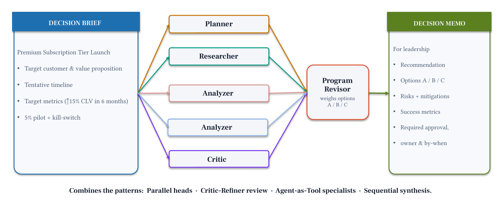

# Module 8: Capstone: Decision-Memo System

Combine all four multi-agent patterns into one complete Decision Intelligence pipeline: from a decision brief to an approved leadership memo.

## Architecture




## Patterns combined

| Pattern | Component | Strands Agents SDK |
|---------|-----------|-------------|
| P1 Sequential | Research phase | Python sequence |
| P2 Fork-Join | Three parallel analyzers | `asyncio.gather` + `invoke_async` |
| P3 Critic-Refiner | Memo quality gate | `GraphBuilder` + cycle edge |
| P5 Agent-as-Tool | Orchestrator delegates all three | `@tool` wrapping each sub-pipeline |

## Files

| File | Purpose |
|------|---------|
| `module-08.ipynb` | Full capstone notebook: prompts → tools → orchestrator → inspect → metrics |
| `chat.py` | Run the complete pipeline interactively |
| `requirements.txt` | `strands-agents>=1.52.0`, `nest-asyncio>=1.6.0` |

## Run

```bash
uv pip install -r requirements.txt
uv run python chat.py
```

## What happens at runtime

1. Orchestrator calls `researcher_agent(topic)` → uses 3 business intel tools
2. Orchestrator calls `parallel_analyzers(brief, research)` → forks A/B/C analyzers with `asyncio.gather`
3. Orchestrator calls `critic_refiner(brief, analyses)` → `GraphBuilder` writer-critic loop until `APPROVED`
4. Final approved memo returned to the orchestrator's context

Typical execution: ~50s, ~11K tokens total (measured with Amazon Nova Pro on Amazon Bedrock).

## Deploy to production

Modules 03 to 08 each include a `production/` folder with the full Amazon Bedrock AgentCore Runtime deployment.

```bash
cd production/
cat README.md
```

## Prerequisites

- Python 3.10 or higher
- All previous modules (01–07). Imports tools from `../02-single-agent/decision_brief_tools.py`.
