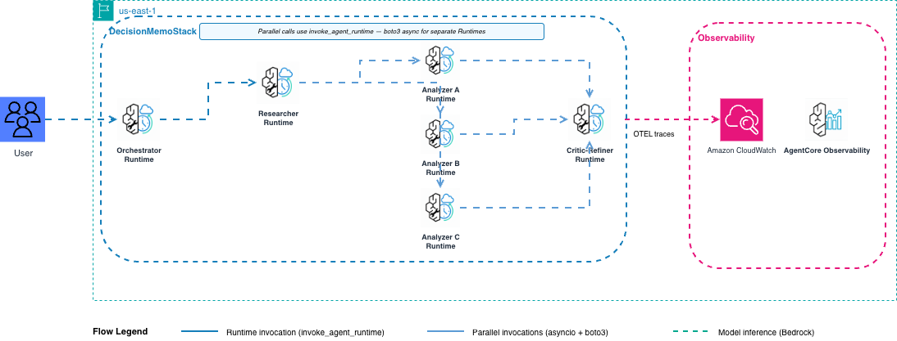

# Capstone (P1+P2+P3+P5) - Production Deployment

Deploy the Capstone pattern to Amazon Bedrock AgentCore: 4 Runtimes + AgentCore Memory for persistent multi-turn conversations.



**Pattern:** Orchestrator (Agent-as-Tool, Module 7 pattern) + parallel fork-join analyzers (Module 4) + Critic-Refiner quality gate (Module 5). All coordinated across 4 separate Runtimes with shared AgentCore Memory.

---

## Why deploy.py is required (not the CLI)

The `agentcore configure` CLI configures a **single runtime** per project. This module deploys **4 runtimes + 1 Memory resource** where:

- 3 specialist runtimes must be deployed first
- The Orchestrator needs the specialist ARNs as env vars at startup
- The Orchestrator needs the Memory ID as an env var at startup
- The CLI cannot coordinate this sequence or inject env vars automatically

`deploy.py` handles all of this with one command.

---

## Contents

- [Files](#files)
- [Architecture](#architecture)
- [Session identifiers](#session-identifiers)
- [Deploy](#deploy)
- [Multi-turn chat](#multi-turn-chat)
- [Invoke single turn](#invoke-single-turn)
- [Cleanup](#cleanup)
- [Observability](#observability)

---

## Files

| File | Purpose |
|------|---------|
| `deploy.py` | **boto3 deploy script** - creates Memory, deploys 3 specialists in parallel, then Orchestrator |
| `cleanup.py` | **boto3 cleanup script** - deletes all 4 runtimes, Memory, IAM roles, S3 objects |
| `chat.py` | **Interactive multi-turn chat** - passes actorId and sessionId correctly |
| `invoke.py` | Single-invocation script (no actorId, no persistent Memory scope) |
| `main.py` | Unused at production (root-level single-runtime variant) |
| `mock_tools.py` | Self-contained business intelligence tools |
| `orchestrator/main.py` | Orchestrator Runtime - lazy singleton + AgentCoreMemorySessionManager |
| `specialists/researcher/main.py` | Researcher specialist - lazy singleton |
| `specialists/analyzer/main.py` | Analyzer specialist (called 3x in parallel) - lazy singleton |
| `specialists/critic_refiner/main.py` | Critic-Refiner specialist - GraphBuilder Writer/Critic loop |

---

## Architecture

```
User
 |  actorId  --> custom HTTP header X-Amzn-Bedrock-AgentCore-Runtime-Custom-Actor-Id
 |  sessionId --> runtimeSessionId parameter (min 33 chars)
 v
Orchestrator Runtime  [AgentCoreMemorySessionManager: STM + LTM]
  |  passes same runtimeSessionId + actorId header to each specialist
  +-- researcher_agent(@tool) --> Researcher Runtime
  +-- parallel_analyzers(@tool) --> Analyzer Runtime x3 (concurrent asyncio)
  +-- critic_refiner(@tool) --> Critic-Refiner Runtime

AgentCore Memory
  |  sessionId scopes short-term events (one conversation)
  |  actorId scopes long-term memory records (one user, all conversations)
  +-- STM: conversation turns stored as events
  +-- LTM: facts extracted by SEMANTIC strategy under /facts/{actorId}
```

---

## Session identifiers

| Identifier | Description | Format | How it travels |
|-----------|-------------|--------|---------------|
| **sessionId** | Unique conversation ID. Routes all calls to the same container (session affinity). Scopes STM events in Memory. | UUID (36 chars) or any alphanumeric string, 33-256 chars for runtimeSessionId | `runtimeSessionId` parameter in `invoke_agent_runtime`. Arrives at container as `context.session_id` via the `X-Amzn-Bedrock-AgentCore-Runtime-Session-Id` header. |
| **actorId** | Permanent user identity. Scopes long-term memory records across all sessions for the same user. | `[a-zA-Z0-9][a-zA-Z0-9-_/]*` 1-255 chars. Example: `user-123` | Custom HTTP header `X-Amzn-Bedrock-AgentCore-Runtime-Custom-Actor-Id`, injected via boto3 `before-sign` event hook. |

The Orchestrator reads both from the request context and propagates them to all specialist calls:
- `context.session_id` -> passed as `runtimeSessionId` to specialists
- `context.request_headers.get("x-amzn-bedrock-agentcore-runtime-custom-actor-id")` -> injected as header in specialist calls

---

## Deploy

Run these commands from the `production/` folder.

```bash
# Navigate to this folder
cd samples/08-capstone/production

# Configure the agent for deployment
agentcore configure -e main.py
# When prompted for a name, enter one <= 23 characters, e.g.: capstone

# Deploy (packages code to S3, provisions Runtime via CloudFormation: ~3-5 min)
agentcore deploy

# Invoke from terminal (pass the Runtime ARN printed by deploy)
python invoke.py arn:aws:bedrock-agentcore:us-east-1:ACCOUNT_ID:agentRuntime/RUNTIME_ID
```

When the deploy finishes, the output includes the **Runtime ARN**. Copy it and pass it to `invoke.py`.

## Multi-turn chat

`chat.py` handles actorId and sessionId correctly for persistent memory:

```bash
# New conversation
python chat.py \
  --actor-id user-123 \
  --runtime-arn arn:aws:bedrock-agentcore:us-east-1:ACCOUNT:runtime/m8_orchestrator-XXXXX

# Resume existing conversation (same actorId - LTM still applies across sessions)
python chat.py \
  --actor-id user-123 \
  --runtime-arn arn:aws:bedrock-agentcore:... \
  --session-id 550e8400-e29b-41d4-a716-446655440000

# Single prompt (non-interactive)
python chat.py \
  --actor-id user-123 \
  --runtime-arn arn:aws:bedrock-agentcore:... \
  --prompt "Analyze NovaCart pricing options A, B, C"
```

`actorId` format requirements:
- Start with alphanumeric: `[a-zA-Z0-9]`
- Remaining chars: alphanumeric, hyphens, underscores, slashes, colons: `[a-zA-Z0-9-_/]*`
- Length: 1-255 chars
- Examples: `user-123`, `org/team/user-456`

`sessionId` is generated as a UUID (36 chars) automatically. Save the printed session ID to resume later with `--session-id`.

---

## Invoke single turn

For testing without persistent memory or actorId:

```bash
python invoke.py arn:aws:bedrock-agentcore:us-east-1:ACCOUNT:runtime/m8_orchestrator-XXXXX
```

---

## Cleanup

```bash
python cleanup.py --name-prefix m8          # delete everything including Memory
python cleanup.py --name-prefix m8 --skip-memory  # keep Memory (reuse across redeploys)
python cleanup.py --name-prefix m8 --dry-run
```

The script deletes all 4 runtimes, their IAM roles, the AgentCore Memory resource, and all S3 code objects.

---

## Observability

AgentCore sends all telemetry to **Amazon CloudWatch**:

- **Logs:** one log group per runtime - `/aws/bedrock-agentcore/runtimes/<id>-DEFAULT`
- **Traces:** CloudWatch Transaction Search (X-Ray settings > GenAI Observability)

Each user turn produces one root trace in the Orchestrator. Tool calls to specialist runtimes appear as child spans, and the Critic-Refiner loop shows multiple Writer/Critic iterations.

---

## IAM permissions

### Specialist runtimes
- `bedrock:InvokeModel` / `bedrock:InvokeModelWithResponseStream`
- CloudWatch Logs write access
- S3 read access (code bundle)

### Orchestrator runtime (additional)
- `bedrock-agentcore:InvokeAgentRuntime` - to call specialist runtimes
- `bedrock-agentcore:CreateEvent`, `GetEvent`, `ListEvents`, `DeleteEvent` - STM operations
- `bedrock-agentcore:RetrieveMemoryRecords`, `ListMemoryRecords`, `GetMemoryRecord` - LTM retrieval

---

## References

- [AgentCore Runtime docs](https://docs.aws.amazon.com/bedrock-agentcore/latest/devguide/runtime.html)
- [AgentCore Memory docs](https://docs.aws.amazon.com/bedrock-agentcore/latest/devguide/memory.html)
- [Strands Agents SDK](https://strandsagents.com)
- [bedrock-agentcore Python SDK](https://pypi.org/project/bedrock-agentcore/)
